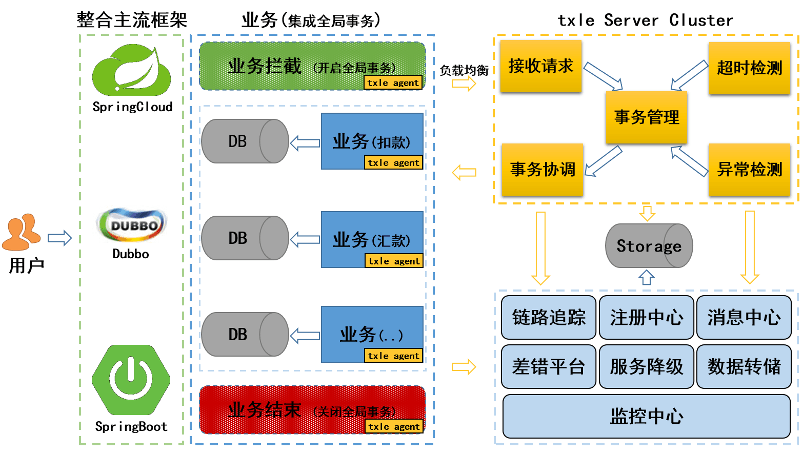

# txle | [English](README.md)    

txle是一款能够保证业务数据最终一致性的分布式事务框架。

## 特征
* 多种手段保证数据最终一致性。
* 高性能。单个事务分支对业务的性能影响在2ms左右。
* 低侵入。最少2个注解即可。
* 支持Docker快速部署。
* 支持服务降级。发生不可抗拒因素时，也能保证主业务正常运行。
* 支持异常快照处理。
* 支持超时和重试机制。

## 架构

## 快速启动
参考快速启动文件[QuickStart.md](./docs/QUICKSTART.md)。  
更多信息请查阅[中文文档](https://actiontech.github.io/txle-docs-cn/1.QuickStart/1.1_deployment.html)。

## 历史
txle是基于[ServiceComb Pack](https://github.com/apache/servicecomb-pack)进行研发的。首先，我们要感谢ServiceComb Pack项目的所有贡献者。

对于txle而言，我们更加专注于金融领域，可适应诸多的复杂业务场景。另外，在稳定性和高性能方面有显著改善，尤其在性能上，我们提升了几倍的QPS。

## 社区
* QQ group: 696990638
* 开源社区微信公众号  

## 贡献
我们欢迎并十分感谢您的贡献。有关提交补丁和贡献流程请参阅[CONTRIBUTION.md](https://github.com/actiontech/txle/blob/master/docs/CONTRIBUTION.md)。
