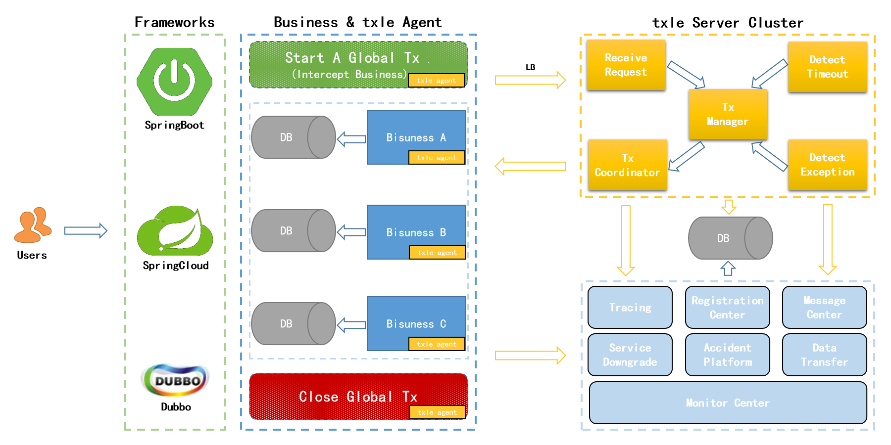

# txle | [English](README.md)
[](https://travis-ci.org/apache/incubator-servicecomb-saga?branch=master) [](https://coveralls.io/github/apache/incubator-servicecomb-saga?branch=master)[](http://search.maven.org/#search%7Cga%7C1%7Corg.apache.servicecomb.saga) [](https://www.apache.org/licenses/LICENSE-2.0.html) [](https://gitter.im/ServiceCombUsers/Saga)

[](https://travis-ci.org/apache/incubator-servicecomb-saga?branch=master) [](https://coveralls.io/github/apache/incubator-servicecomb-saga?branch=master)[](http://search.maven.org/#search%7Cga%7C1%7Corg.apache.servicecomb.saga) [](https://www.apache.org/licenses/LICENSE-2.0.html) [](https://gitter.im/ServiceCombUsers/Saga)

## 什么是txle？
txle是一款能够保证业务数据最终一致性的分布式事务解决方案。

## 特征
* 多种手段保证数据最终一致性。
* 高性能。QPS为5000/s左右，TPS为50000/s左右。
* 低侵入。最少2个注解即可。
* 支持Docker快速部署。
* 支持服务降级。发生不可抗拒因素时，也能保证主业务正常运行。
* 支持异常快照处理。
* 支持超时和重试机制。

## 架构



## 快速启动

### Step 1: 下载txle正式版本
[下载](https://github.com/actiontech/txle/releases)最新版本并解压。

```bash
# tar -xzf actiontech-txle-$version.tar.gz
# mv actiontech-txle-$version txle
# cd txle
```

### Step 2: 准备环境
* MySQL实例

    在部署txle服务的机器中启动一个MySQL实例，创建名为txle的数据库，用户为test，密码为123456。

* JVM

    txle是使用java开发的，所以需要在部署txle服务的机器上安装java 1.8或以上版本，并确保JAVA_HOME参数被正确的设置。

### Step 3: 启动txle服务

```bash
# ./txle start
Starting the txle server....
Start successfully!
```
### Step 4: 停止txle服务

```bash
# ./txle stop
Stopping the txle server....
Stop successfully!
```

## 官网

了解更多信息，欢迎访问[官网](https://opensource.actionsky.com/)。

## 贡献

我们欢迎并十分感谢您的贡献。有关提交补丁和贡献流程请参阅[CONTRIBUTION.md](https://github.com/actiontech/txle/docs/CONTRIBUTION.md)。

## 社区 TODO

* IRC: [](https://kiwiirc.com/client/irc.freenode.net/?nick=user|?&theme=cli#txle)
* QQ group: 669663113
* [如果您正在使用txle，请告诉我们。](https://wj.qq.com/s/2291106/09f4)
* 开源社区问下公众号
  
  

## 联系我们

如果想获得txle的商业支持, 您可以联系我们:

- 全国支持: 400-820-6580
- 华北地区: 86-13718877200, 王先生
- 华南地区: 86-18503063188, 曹先生
- 华东地区: 86-18930110869, 梁先生
- 西南地区: 86-13540040119, 洪先生